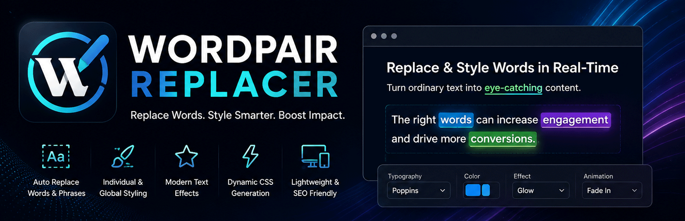

  

  
  
  
  

  <a href="#deutsch">🇩🇪 Deutsch</a> · <a href="#english">🇬🇧 English</a>

  <a href="https://github.com/nickdesignz/wordpair-replacer/releases/download/latest/wordpair-replacer.zip"><strong>⬇️ Download latest build (.zip)</strong></a> · <a href="https://github.com/nickdesignz/wordpair-replacer/releases">All releases</a>

---

## 🇩🇪 Deutsch

### Was ist WordPair Replacer?

WordPair Replacer ist ein WordPress-Plugin, mit dem du Wort- oder Phrasenpaare definierst, die automatisch im Frontend deiner Website ersetzt werden — ganz ohne jeden Beitrag oder jede Seite einzeln zu bearbeiten. Jedes ersetzte Wort kann global oder individuell gestylt werden: Typografie, Farben, Farbverläufe, Rahmen, Abstände und über 25 moderne Texteffekte und Animationen.

**Typische Einsatzzwecke:**
- Wiederkehrende Keywords, Markennamen oder Produktnamen auf der ganzen Website einheitlich hervorheben oder verlinken.
- Landingpages und Marketing-Texte optisch aufwerten, ohne den Seiteninhalt manuell zu verändern.
- Interne SEO-Verlinkung bestimmter Begriffe automatisieren.
- Leichte, performante Text-Anpassungen im Frontend, ohne Shortcodes oder Theme-Änderungen.

### Herunterladen & Installation

- **[Aktuellen Build herunterladen (.zip)](https://github.com/nickdesignz/wordpair-replacer/releases/download/latest/wordpair-replacer.zip)** — immer auf dem Stand des `main`-Branches.
- **[Alle Releases](https://github.com/nickdesignz/wordpair-replacer/releases)** — stabile, versionierte Downloads.

Installation: In WordPress zu **Plugins → Installieren → Plugin hochladen**, die heruntergeladene `.zip`-Datei auswählen, **Jetzt installieren** und anschließend **Aktivieren** klicken.

### Funktionen

**🔤 Wort-Ersetzung**
- Beliebig viele Wort-/Phrasenpaare anlegen, bearbeiten, aktivieren/deaktivieren und löschen.
- Automatische Ersetzung im gesamten Frontend-Output — Beiträge, Seiten, Widgets, Theme-Ausgabe.
- Optional Groß-/Kleinschreibung beachten.
- Optional nur ganze Wörter ersetzen (kein Teiltreffer in längeren Wörtern).
- `<script>`, `<style>`, `<code>`, `<pre>`, `<svg>` und `<textarea>` werden automatisch übersprungen; einzelne Bereiche lassen sich zusätzlich per `data-wpr-ignore`-Attribut oder `wpr-ignore`-CSS-Klasse gezielt von der Ersetzung ausschließen.

**🎨 Styling & Design**
- Globales Styling für alle ersetzten Wörter, plus individuelles Styling pro Wortpaar (überschreibt das globale).
- Typografie: Schriftart (Systemschriften oder optionale Google Fonts), Größe, Stärke, Zeilenhöhe, Stil, Dekoration, Textumwandlung, Zeichen-/Wortabstand, Zeilenumbruch.
- Farben: Textfarbe, Hintergrundfarbe, Text-Farbverlauf, Hintergrund-Farbverlauf (linear/radial, mit Winkel/Position), Text-Schatten/Glow.
- Rahmen: Breite (pro Seite einzeln), Stil, Farbe, Radius (pro Ecke einzeln).
- Abstände (Padding) pro Seite einzeln.
- Live-Vorschau direkt im Backend, mit Hell/Dunkel-Vorschau-Modus.

**✨ Effekte & Animationen**
- Über 25 Texteffekte: Fade In, Slide In (4 Richtungen), Zoom, Bounce, Pulse, Shake, Blur In, Typing-Effekt, Glitch, Neon Glow, Text Shadow Glow, Gradient-Text, Gradient-Animation, Shimmer, Stroke-Text, 3D-Text, Hover-Highlight, Reveal-Varianten und mehr.
- Steuerbare Animationsdauer, Verzögerung, Endlos-Loop (bei geeigneten Effekten) und Easing-Kurve.

**🔗 Link & SEO**
- Ersetztes Wort automatisch verlinken — interne Seiten-/Beitragssuche oder freie URL.
- Ziel (gleicher Tab / neuer Tab), `rel`-Attribute (nofollow, sponsored, noopener), Title, ARIA-Label.
- Eigene Link-Farbe und Hover-Farbe.
- Automatische CSS-Klasse pro Wortpaar, plus optionale eigene CSS-Klasse/ID und pro Wortpaar gescoptes Custom CSS.
- Zusätzliches globales Custom-CSS-Feld für seitenweite Anpassungen.

**📦 Presets**
- 12 mitgelieferte visuelle Presets (u. a. SEO Highlight, Neon Glow, Cyberpunk, Premium Gold, Glass Accent) als Startpunkt.
- Eigene Presets speichern, aus der Preset-Bibliothek anwenden und im `.wprpreset`-Format exportieren/importieren, um Styles zwischen Websites zu teilen.

**🔄 Import / Export**
- Alle Wortpaare als JSON exportieren und auf einer anderen Website wieder importieren — praktisch für Staging → Live oder Multi-Site-Setups.

**⚙️ Bedienung**
- Zweisprachige Backend-Oberfläche (Deutsch/Englisch), unabhängig von der WordPress-Systemsprache umschaltbar.
- Helles/dunkles Admin-Theme.
- AJAX-basierte Oberfläche ohne Seiten-Reloads.
- Dynamisch generierte Frontend-CSS-Datei (separate Datei im Uploads-Verzeichnis statt Inline-Styles) für bessere Performance.
- Google Fonts sind standardmäßig deaktiviert (Datenschutz) und werden nur bei expliziter Aktivierung geladen.

**🛡️ Kompatibilitäts- & Systemprüfung**
- Lokale Prüfung auf veraltete WordPress-Core-, Plugin- und Theme-Versionen (ohne externe Datenübertragung).
- Erkennung gängiger Optimierungs-Plugins (WP Rocket, LiteSpeed Cache, Autoptimize, W3 Total Cache, FlyingPress, Perfmatters u. a.) mit Hinweisen zu empfohlenen Cache-Ausschlüssen.
- Support-Ticket-System direkt im Backend (E-Mail-Versand, lokaler Verlauf, Rate-Limiting, Spam-Schutz).

### Kompatibilität

- **Elementor:** getestet und funktioniert einwandfrei.
- **Ohne Elementor** (klassischer Editor / Gutenberg): ebenfalls getestet und funktioniert — WordPair Replacer ersetzt Text direkt im gerenderten Frontend-Output und ist nicht an einen bestimmten Page-Builder gebunden.
- **Andere Page-Builder** (z. B. Divi, Beaver Builder, Bricks, Oxygen): noch nicht getestet. Da die Ersetzung auf HTML-Ebene im Frontend-Output arbeitet, ist eine Kompatibilität wahrscheinlich, aber bislang nicht verifiziert. Rückmeldungen dazu sind über das Support-Ticket-System willkommen.
- **Anforderungen:** WordPress 6.0+, PHP 8.0+.

### Roadmap — was als Nächstes kommt

- **Externe Schwachstellenprüfungen:** Anbindung an WPVulnerability, Wordfence Intelligence, WPScan und Patchstack für optionale externe Sicherheits-Scans (aktuell in der Oberfläche als „Bald verfügbar" markiert — es werden noch keine Daten an diese Anbieter gesendet).
- **Premium-Funktionen:** Die kostenlose Version ist voll funktionsfähig; weitere Funktionen können künftig als Premium-Erweiterung folgen.
- **Breitere Page-Builder-Tests:** Verifizierte Kompatibilität mit weiteren Page-Buildern über Elementor hinaus.

### Sicherheit & Datenschutz

- Keine Besucher-Verfolgung, keine Übertragung von Nutzungsdaten an externe Dienste.
- Google Fonts nur bei expliziter Aktivierung durch den Administrator.
- Der „Buy Me a Coffee"-Link im Backend ist ein reiner Link ohne eingebettete Tracking-Skripte.
- Alle AJAX-Aktionen sind durch Nonces und Berechtigungsprüfungen (`manage_options`) abgesichert; Eingaben werden serverseitig validiert und Ausgaben escaped.

### Support & Mitwirken

- Support-Anfragen direkt über das **Support**-Menü im Plugin.
- [Buy me a coffee](https://buymeacoffee.com/nickdesignz), wenn dir das Plugin hilft.
- Fehler oder Verbesserungsvorschläge gerne als [GitHub Issue](https://github.com/nickdesignz/wordpair-replacer/issues) melden.

### Lizenz

GPLv2 oder später — siehe [readme.txt](readme.txt) für den vollständigen Lizenz-Header.

---

## 🇬🇧 English

### What is WordPair Replacer?

WordPair Replacer is a WordPress plugin that lets you define word or phrase pairs which are automatically replaced across your site's frontend — without editing every post or page by hand. Every replaced word can be styled globally or individually: typography, colors, gradients, borders, spacing and 25+ modern text effects and animations.

**Typical use cases:**
- Consistently highlight or link recurring keywords, brand names or product names across the entire site.
- Visually enhance landing pages and marketing copy without manually editing page content.
- Automate internal SEO linking for specific terms.
- Lightweight, performant frontend text adjustments without shortcodes or theme edits.

### Download & Installation

- **[Download latest build (.zip)](https://github.com/nickdesignz/wordpair-replacer/releases/download/latest/wordpair-replacer.zip)** — always up to date with the `main` branch.
- **[All releases](https://github.com/nickdesignz/wordpair-replacer/releases)** — stable, versioned downloads.

To install: in WordPress, go to **Plugins → Add New → Upload Plugin**, select the downloaded `.zip` file, click **Install Now**, then **Activate**.

### Features

**🔤 Word Replacement**
- Add, edit, activate/deactivate and delete an unlimited number of word or phrase pairs.
- Automatic replacement across the entire frontend output — posts, pages, widgets, theme output.
- Optional case-sensitive matching.
- Optional whole-word-only matching (no partial matches inside longer words).
- `<script>`, `<style>`, `<code>`, `<pre>`, `<svg>` and `<textarea>` blocks are automatically skipped; specific areas can also be excluded from replacement via a `data-wpr-ignore` attribute or `wpr-ignore` CSS class.

**🎨 Styling & Design**
- Global styling for all replaced words, plus individual per-word-pair styling that overrides the global style.
- Typography: font family (system fonts or optional Google Fonts), size, weight, line height, style, decoration, text transform, letter/word spacing, line wrapping.
- Colors: text color, background color, text gradient, background gradient (linear/radial, with angle/position), text shadow/glow.
- Border: width (per side), style, color, radius (per corner).
- Padding, per side.
- Live preview directly in the admin, with a light/dark preview mode.

**✨ Effects & Animations**
- 25+ text effects: fade in, slide in (4 directions), zoom, bounce, pulse, shake, blur in, typing effect, glitch, neon glow, text shadow glow, gradient text, gradient animation, shimmer, stroke text, 3D text, hover highlight, reveal variants and more.
- Configurable animation duration, delay, infinite loop (for suitable effects) and easing curve.

**🔗 Link & SEO**
- Automatically link the replaced word — internal page/post search or a free-form URL.
- Target (same tab / new tab), `rel` attributes (nofollow, sponsored, noopener), title, ARIA label.
- Custom link color and hover color.
- Automatic CSS class per word pair, plus an optional custom CSS class/ID and scoped custom CSS per word pair.
- An additional global custom CSS field for site-wide adjustments.

**📦 Presets**
- 12 built-in visual presets (including SEO Highlight, Neon Glow, Cyberpunk, Premium Gold, Glass Accent) as a starting point.
- Save your own presets, apply them from the preset library, and export/import them in the `.wprpreset` format to share styles between websites.

**🔄 Import / Export**
- Export all word pairs as JSON and import them on another site — useful for staging → production or multi-site setups.

**⚙️ Usability**
- Bilingual admin interface (English/German), switchable independently of the WordPress site language.
- Light/dark admin theme.
- AJAX-based interface with no page reloads.
- Dynamically generated frontend CSS file (a separate file in the uploads directory instead of inline styles) for better performance.
- Google Fonts are disabled by default (privacy) and only load when explicitly enabled.

**🛡️ Compatibility & System Check**
- Local check for outdated WordPress core, plugin and theme versions (no external data transmission).
- Detection of common optimization plugins (WP Rocket, LiteSpeed Cache, Autoptimize, W3 Total Cache, FlyingPress, Perfmatters and others) with hints on recommended cache exclusions.
- Built-in support ticket system (email delivery, local history, rate limiting, spam protection).

### Compatibility

- **Elementor:** tested and works reliably.
- **Without Elementor** (classic editor / Gutenberg): also tested and works — WordPair Replacer replaces text directly in the rendered frontend output and is not tied to any specific page builder.
- **Other page builders** (e.g. Divi, Beaver Builder, Bricks, Oxygen): not yet tested. Since replacement operates at the HTML level of the rendered frontend output, compatibility is likely but not yet verified. Feedback is welcome via the support ticket system.
- **Requirements:** WordPress 6.0+, PHP 8.0+.

### Roadmap — what's coming next

- **External vulnerability checks:** integration with WPVulnerability, Wordfence Intelligence, WPScan and Patchstack for optional external security scans (currently marked "Coming soon" in the UI — no data is sent to these providers yet).
- **Premium features:** the free version is fully functional; additional features may follow as a premium extension later.
- **Broader page builder testing:** verified compatibility with more page builders beyond Elementor.

### Security & Privacy

- No visitor tracking, no usage data sent to external services.
- Google Fonts load only when explicitly enabled by the administrator.
- The "Buy Me a Coffee" link in the admin is a plain link with no embedded tracking scripts.
- Every AJAX action is protected by nonces and a capability check (`manage_options`); input is sanitized server-side and output is escaped.

### Support & Contributing

- Submit support requests directly via the plugin's **Support** menu.
- [Buy me a coffee](https://buymeacoffee.com/nickdesignz) if this plugin helps you.
- Bug reports and feature suggestions are welcome as a [GitHub issue](https://github.com/nickdesignz/wordpair-replacer/issues).

### License

GPLv2 or later — see [readme.txt](readme.txt) for the plugin's full license header.

---

Made with ❤️ by <a href="https://nickdesignz.de">NickDesignz</a>

